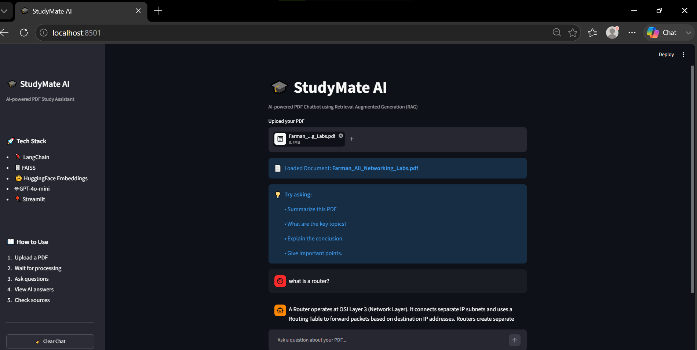

# 🎓 StudyMate AI

An AI-powered PDF Study Assistant built with **LangChain, FAISS, HuggingFace Embeddings, OpenAI GPT-4o-mini, and Streamlit**.

Upload any PDF, ask questions in natural language, and receive accurate answers with source references using Retrieval-Augmented Generation (RAG).

---

## 🚀 Live Demo

🔗 https://studymate-ai-farman.streamlit.app/

---

## 📸 Screenshot



---

## ✨ Features

- 📄 Upload any PDF document
- 🤖 AI-powered question answering
- 🧠 Retrieval-Augmented Generation (RAG)
- 💬 Conversational chat memory
- 📚 Source references for every answer
- ⚡ Fast semantic search with FAISS
- 🎨 Clean and responsive Streamlit UI

---

## 🛠️ Tech Stack

- Python
- Streamlit
- LangChain
- FAISS Vector Database
- HuggingFace Embeddings
- OpenAI GPT-4o-mini
- PyPDF

---

## 📂 Project Structure

```text
StudyMate-AI/
│
├── assets/
│   └── studymate-demo.png
│
├── utils/
│   ├── llm.py
│   ├── pdf_reader.py
│   ├── qa_chain.py
│   ├── search.py
│   ├── text_splitter.py
│   └── vector_store.py
│
├── app.py
├── requirements.txt
├── README.md
└── .gitignore
```

---

## ⚙️ Installation

Clone the repository

```bash
git clone https://github.com/itsrealfarman/StudyMate-AI.git
```

Move into the project

```bash
cd StudyMate-AI
```

Create virtual environment

```bash
python -m venv venv
```

Activate virtual environment

### Windows

```bash
venv\Scripts\activate
```

### macOS/Linux

```bash
source venv/bin/activate
```

Install dependencies

```bash
pip install -r requirements.txt
```

---

## 🔑 Environment Variables

Create a `.env` file in the project root.

```env
OPENAI_API_KEY=your_openai_api_key
```

---

## ▶️ Run the Application

```bash
streamlit run app.py
```

The application will open in your browser.

---

## 💡 Example Questions

- Summarize this PDF.
- What are the key topics?
- Explain the conclusion.
- What is a Router?
- What is the OSI Model?
- Give me important points.

---

## 🧠 How It Works

1. Upload a PDF.
2. Extract text from the document.
3. Split text into chunks.
4. Generate embeddings using HuggingFace.
5. Store embeddings in FAISS.
6. Retrieve the most relevant chunks.
7. Generate answers using GPT-4o-mini.
8. Display source references.

---

## 📈 Future Improvements

- Multiple PDF support
- Chat history export
- PDF highlighting
- Voice input
- Citation links
- Dark/Light theme
- Streaming responses
- Local LLM support with Ollama

---

## 👨‍💻 Author

**Farman Ali**

- GitHub: https://github.com/itsrealfarman
- LinkedIn: https://www.linkedin.com/in/farman-ali-78850b339/

---

## ⭐ Support

If you found this project helpful, please consider giving it a ⭐ on GitHub.

It helps others discover the project and motivates future improvements.